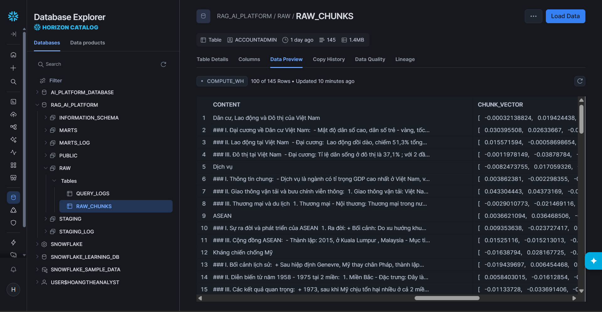
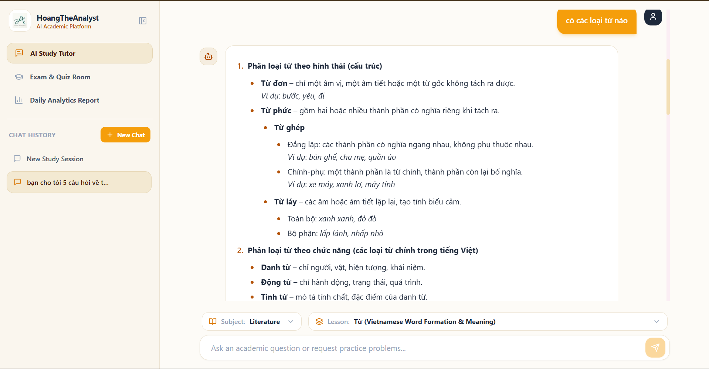
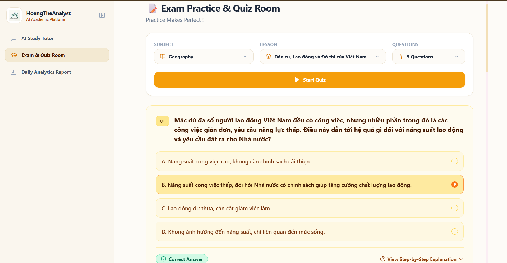
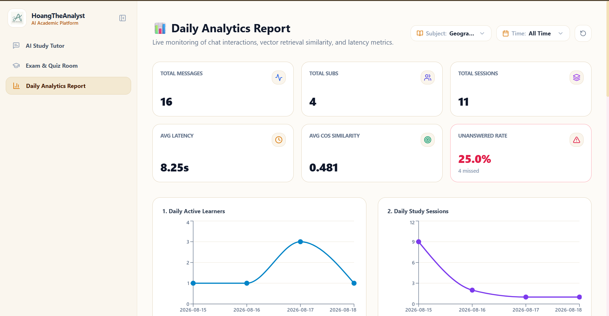

# 🎓Project 10: Create a RAG AI Platform For Edtech Company

---

## Tech Stack:

RAG, Snowflake, dbt, Airbyte, FastAPI, Next.js 14, Groq Cloud API, Cohere API, Open-Weight LLMs, GitHub Actions CI/CD

---

## **Demo Preview**: 
[Demo Live](https://ai-rag-platform-three.vercel.app/dashboard) 
(Please wait 10 - 50 seconds for the backend to warm up on Vercel free-tier hosting.)

---

## 1. Context & Business Objectives

### Business Context
An EdTech center preparing Grade 12 students for national university entrance examinations requires an AI assistant capable of grounding answers in existing proprietary curricula, answering student concept inquiries, and guiding step-by-step exercise solutions. However, leadership hesitated to commit capital expenditure without a concrete Proof of Concept (PoC) demonstrating retrieval precision, telemetry observability, and overall operational value.

### Strategic Objective
Build a production-grade, end-to-end RAG and Analytics Engineering ecosystem with **$0 infrastructure cost**:
* **Embedding Inference:** Serverless API calls via `embed-multilingual-v3.0` (1024-dimensional space).
* **LLM Generation:** Open-weight inference via cloud endpoints (`gpt-oss-120B` / Groq Cloud API).
* **Cloud Data Warehouse:** Free-tier Snowflake instance hosting raw ingestion, dimensional staging, and analytics marts.
* **Web & API Hosting:** Free-tier deployment on Next.js 14 and FastAPI.

---

## 2. Curriculum Ingestion & Vector Pipeline

### Source Documents
The knowledge base comprises standardized curricula across three core humanities subjects: **History**, **Literature**, and **Geography**. Each subject contains 2 comprehensive theory lecture documents and 2 curated multiple-choice exercise sets formatted in `.docx` with standardized typography and bold section markers to enable deterministic semantic parsing without complex OCR or LaTeX dependencies.

### Ingestion Workflow & Pipeline Architecture

* **Differentiated Semantic Chunking:** Theory documents are split by major conceptual sections (`#`, `##`), while exercise files are isolated per individual question stem and option set, serializing intermediate outputs into structured JSON.
* **Hierarchical Metadata Labeling:** Subject, lesson name, and content type (`theory` vs. `exercise`) are automatically extracted from source file system paths (e.g., `Documents/Exercise/History/ASEAN.docx` → `subject: History`, `content_type: exercise`, `lesson_name: ASEAN`) to empower high-speed metadata pre-filtering.
* **Vector Ingestion:** Content chunks are converted into 1024-dimensional embeddings via `embed-multilingual-v3.0` and bulk-loaded directly into Snowflake table `RAW.RAW_CHUNKS`.


*Figure 1: Snowflake data warehouse staging showing ingested curriculum records and native vector representations in `RAW.RAW_CHUNKS`.*

---

## 3. Data Transformation & Modeling on Snowflake (dbt)

Data transformations enforce Medallion Architecture principles (`RAW` → `STAGING` → `MARTS`), orchestrated via dbt with built-in data quality tests (`unique`, `not_null`, `accepted_values`, and singular business logic tests).

#### A. Academic Knowledge Marts (`marts`)
* **`dim_lesson`:** Normalized dimension table capturing lesson titles and subjects, eliminating redundant string storage across chunks.
* **`fct_chunks`:** Fact table holding chunk text, metadata keys, and native Snowflake vector arrays (`VECTOR(FLOAT, 1024)`).

#### B. Telemetry & Observability Marts (`marts_log`)
* **`fct_log`:** High-performance telemetry mart for real-time and daily executive reporting. Captures anonymized IP hashes (`hashed_client_ip`), latency in seconds, cosine similarity margins, and retrieval failure flags (`no_chunks_retrieved`).
* **`fct_answer`:** Restricted audit mart storing complete raw student prompts and AI response outputs for quality review and pedagogical evaluations.

---

## 4. End-to-End System Workflows

```text
[Student UI: Next.js 14] 
         │ (REST API / Pydantic)
         ▼
[Backend Service: FastAPI] 
         │ (Vector Search + SQL Filter)
         ▼
[Snowflake Data Warehouse] ──► [LLM Inference Engine] ──► [Answer Streamed to UI]
```

#### A. AI Study Tutor (Context Retrieval & QA)
1. Student submits a question via Next.js frontend.
2. FastAPI vectorizes the query text via embedding API.
3. Executes in-database `VECTOR_COSINE_SIMILARITY` on `MARTS.FCT_CHUNKS` with metadata pre-filtering (`subject`, `lesson_sk`) and threshold cutoff ($0.55$).
4. Retrieved context chunks are injected into system prompt and passed to the LLM.
5. The generated pedagogical response streams back to the UI, while execution metrics are written to `RAW.QUERY_LOGS`.


*Figure 2: AI Study Tutor workspace showing retrieval-grounded explanations and contextual concept breakdown.*

#### B. Practice Examination Room
1. Student selects a subject and specific lesson topic.
2. FastAPI queries `MARTS.FCT_CHUNKS` for `content_type = 'exercise'` matched against target `lesson_sk`.
3. Formatted interactive question cards render dynamically on the frontend.


*Figure 3: Interactive Examination Room rendering curriculum-aligned multiple-choice questions.*

#### C. Telemetry & KPI Dashboard
1. Frontend fetches aggregated operational metrics from `MARTS_LOG.FCT_LOG`.
2. Visualizes system health: query volume trends, latency distributions, average similarity scores, and zero-chunk rate.


*Figure 4: Executive Telemetry & KPI Dashboard monitoring retrieval precision, latency SLAs, and query volume.*

---

## 5. System Boundaries & Known Limitations

* **Curriculum Domain Scope:** Designed exclusively for humanities subjects (History, Geography, Literature) using clean `.docx` sources. Does not currently support complex PDF formatting, image OCR, or mathematical LaTeX formulas.
* **Storage Architecture:** Utilizes direct appends to Snowflake for telemetry rather than an independent OLTP transactional database.
* **Inference Dependency:** Relies on managed external cloud APIs for vector embeddings and LLM inference to operate within free hosting resource limits.
* **Local Ingestion Execution:** The `vector_creation` pipeline runs locally via CLI scripts (configurable via source argument flags in `vector_creation/src`).

---

## 6. Project Architecture Overview

```text
├── .github/workflows/          # CI/CD: Automated daily dbt transformation pipeline
├── vector_creation/            # 6-step sequential ETL, semantic chunking & vector ingestion
├── rag_dbt/                    # dbt Core project: Staging & Gold Marts (Documents & Telemetry)
├── rag_platform/               # Application layer (FastAPI backend + Next.js 14 frontend)
│   ├── backend/                # API router, Snowflake connectors & RAG retrieval logic
│   └── frontend/               # Chat room, exam engine & executive telemetry dashboard
├── docs/                       # Architecture decisions, data dictionary & query specs
└── images/                     # UI previews and performance dashboard assets
```

> 📂 **Detailed Directory Map:** For the comprehensive, file-by-file annotated tree of the entire codebase, see [docs/project_structure.md](docs/project_structure.md).

---

## 7. Technical Documentation & Key Resources

For in-depth technical implementation details, architectural trade-offs, and query specifications, explore the dedicated documentation guides:

* 🏛️ **[Architecture Decision Records (ADRs)](https://github.com/HoangTheAnalyst/Project-10-Create-a-RAG-Vectorize-AI-Platform-for-Edtech-Company/blob/master/docs/architecture_decisions.md):** Detailed breakdown of technical trade-offs, model sizing, threshold configurations, and storage choices.
* 📖 **[Data Dictionary](https://github.com/HoangTheAnalyst/Project-10-Create-a-RAG-Vectorize-AI-Platform-for-Edtech-Company/blob/master/docs/data_dictionary.md):** Full column-level definitions, surrogate key formulas, and dbt constraints across `marts` and `marts_log` schemas.
* 🚀 **[Deployment Guide](https://github.com/HoangTheAnalyst/Project-10-Create-a-RAG-Vectorize-AI-Platform-for-Edtech-Company/blob/master/docs/deployment_guide.md):** Comprehensive instructions for local pipeline runs, Docker containerization, Snowflake RBAC configuration, and GitHub Actions CI/CD.
* 🔍 **[Important SQL Queries](https://github.com/HoangTheAnalyst/Project-10-Create-a-RAG-Vectorize-AI-Platform-for-Edtech-Company/blob/master/docs/important_sql.md):** Direct analytical queries, Snowflake vector similarity logic, and administrative scripts for user provisioning.