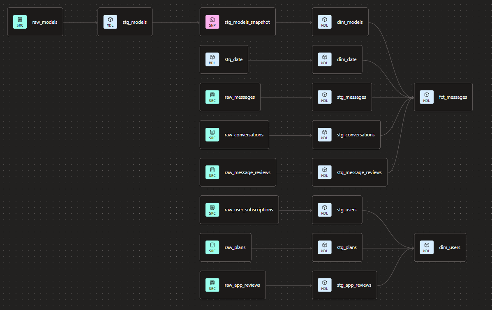
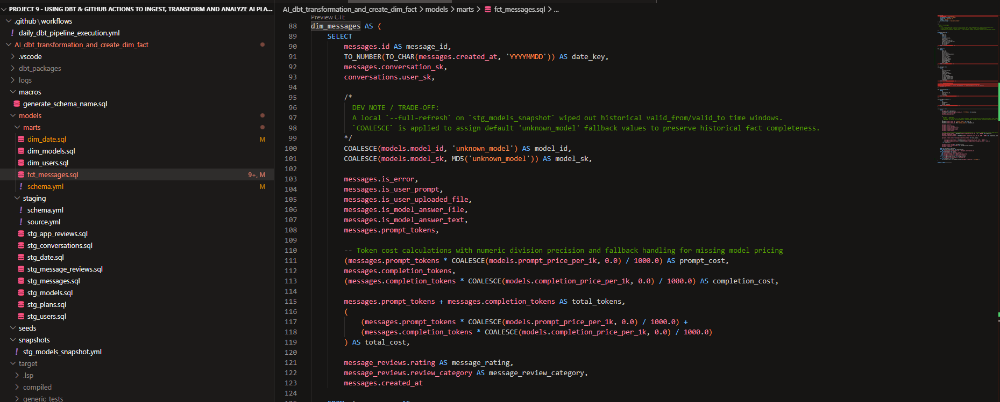
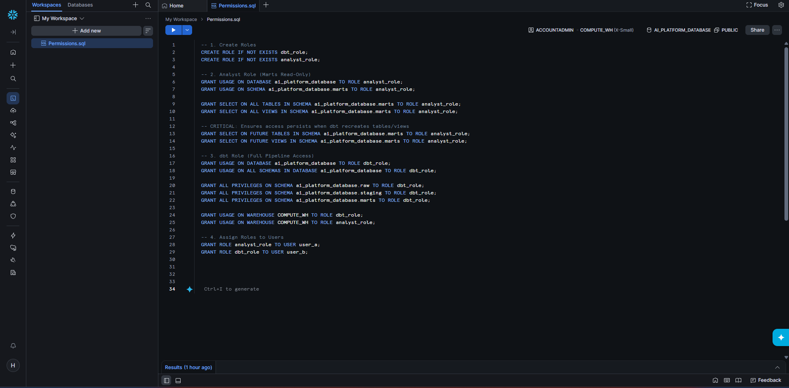

# Project 9: End-to-End AI Platform Pipeline Analytics Engineer with Snowflake, dbt & Airbyte

## 1. Executive Summary & Overview

* **Business Scenario**: An EdTech company is deploying an AI-powered learning assistant designed to enhance student engagement for Grade 12 learners. As the platform approaches production readiness, an automated, self-testing, and resilient pipeline is critical to detect edge-case anomalies and prevent data quality degradation from impacting downstream analytics.
* **Core Objectives**: Deliver an end-to-end production-grade data pipeline ready for Business Intelligence (BI) tools:
  1. **Automated Ingestion**: Ingest transactional data seamlessly from Neon DB to Snowflake via Airbyte.
  2. **Medallion Modeling & Testing**: Execute a multi-layered data transformation strategy (Raw -> Staging -> Marts) using dbt, embedded with rigorous testing suites for edge cases, null handling, and business logic validations.
  3. **Data Governance & Security**: Implement granular Role-Based Access Control (RBAC) in Snowflake to isolate staging layers and expose only production-ready Marts (`dim_*` and `fct_*`) to downstream analysts.
  4. **CI/CD Automation**: Deploy the codebase to GitHub and establish scheduled GitHub Actions workflows to automate daily dbt execution, freshness checks, and test suite verification.

---

## 2. Source Data Architecture

* **Database Engine**: **Neon DB** (Serverless PostgreSQL) serving as the core transactional OLTP store.
* **Data Schema**: Normalized enterprise OLTP structure tracking entity lifecycles across eight primary tables: `users`, `user_subscriptions`, `conversations`, `messages`, `app_reviews`, `message_reviews`, `plans`, and `models`.
* **Business Context**: Captures interaction telemetry from Grade 12 students. Under the current EdTech service model, access is governed via token allocation (capped free tiers vs. unlimited subscription tiers) rather than direct per-transaction billing.

*Figure 1: Normalized PostgreSQL OLTP Entity-Relationship Diagram (ERD) capturing source transactional entities.*

> 💡 **Source Data Repository**: For data generation logic, mock datasets, and DDL scripts, please visit the [Source Data Repository](https://github.com/hai262626/fake-AI-data).

### 3. Data Ingestion Architecture (Airbyte)

* **Ingestion Engine**: **Airbyte Cloud** running automated replication pipelines from Neon DB (OLTP) to Snowflake (Data Warehouse).
* **Sync Strategy**: Incremental / Append-Deduplicate synchronization configured for high-volume event streams (`messages`, `message_reviews`) alongside full-refresh syncs for entity tables (`plans`, `models`, `users`).
* **Landing Zone**: Raw transactional payloads are landed directly in Snowflake's `RAW` schema, preserving original JSON structures and extraction metadata (eg. `_airbyte_extracted_at`).

*Figure 2: Airbyte replication pipeline configuration connecting Neon DB PostgreSQL source to Snowflake raw landing zone.*

---

## 4. Transformation & Modeling Framework (dbt Core / dbt Fusion)

* **Architecture Pattern**: Medallion Data Architecture implemented via `dbt-core` and `dbt-snowflake`:
  * **Raw Layer**: Immutable landed transactional tables.
  * **Staging Layer (`stg_*`)**: Standardizes column naming, casts data types, cleans UTC timestamps, dealing nulls, and applies basic business logic.
  * **Snapshot Layer (`stg_*_snapshot`)**: Tracks Slowly Changing Dimensions (SCD Type 2) for model price update.
  * **Marts Layer (`dim_*`, `fct_*`)**: Star-schema dimension and fact models (`dim_users`, `dim_models`, `dim_date`, `fct_messages`)
* **Data Quality & Testing Suite**: Embedded tests in every level verifying primary key constraints (`not_null`, `unique`), referential integrity (`relationships`), accept_values, along with custom business rules (e.g., timestamp sequence assertions) and source freshness monitoring (`dbt source freshness`).

*Figure 3: dbt Directed Acyclic Graph (DAG) displaying end-to-end data lineage from raw sources to dimensional marts.*

*Figure 4: dbt SQL transformation logic generating the central `fct_messages` fact table.*

> 📁 **Models Directory**: All core transformation logic (`staging/` and `marts/`) along with source declarations are located under [AI_dbt_transformation_and_create_dim_fact/models](https://github.com/HoangTheAnalyst/Project-9-Using-dbt-to-Ingest-Transform-and-Analyze-AI-Platform-Data-in-a-Edtech-Company/blob/master/AI_dbt_transformation_and_create_dim_fact/models)

> 📁 **Snapshots Directory**: SCD Type 2 tracking configurations for historical entity updates are stored under [AI_dbt_transformation_and_create_dim_fact/snapshots/](https://github.com/HoangTheAnalyst/Project-9-Using-dbt-to-Ingest-Transform-and-Analyze-AI-Platform-Data-in-a-Edtech-Company/blob/master/AI_dbt_transformation_and_create_dim_fact/snapshots)
---

## 5. Security & Access Control (Snowflake RBAC)

* **Role-Based Access Control (RBAC)**: Enforces strict separation of concerns and least-privilege security across database schemas.
  * **`DBT_ROLE`**: Managed service account role used by GitHub Actions with full `CREATE`, `INSERT`, `UPDATE`, and `DROP` privileges across `RAW`, `STAGING`, and `MARTS` schemas.
  * **`ANALYST_ROLE`**: Restricted consumer role assigned to Data Analysts and BI tools (Power BI / Tableau). Granted `SELECT` access exclusively on `MARTS` schema objects (`dim_*`, `fct_*`), while completely obscuring upstream `RAW` and `STAGING` layers.
* **Future Privilege Management**: Leverages Snowflake `GRANT SELECT ON FUTURE TABLES/VIEWS` directives to ensure consumer roles automatically retain access when dbt rebuilds tables or view models.

*Figure 5: Snowflake role privilege verification confirming schema-level isolation and access grants for analyst and pipeline roles.*

---

## 6. Automation & CI/CD Pipeline (GitHub Actions)

* **Orchestration**: Scheduled daily execution triggered via GitHub Actions (`.github/workflows/dbt_daily_run.yml`).
* **Workflow Steps**:
  1. **Environment Setup**: Provisions Python environment and installs production dependencies (`dbt-core`, `dbt-snowflake`).
  2. **Dynamic Profile Injection**: Generates `profiles.yml` securely at runtime using GitHub Actions Secrets.
  3. **Freshness & Integrity Checks**: Executes `dbt source freshness` to detect upstream pipeline delays.
  4. **Build & Test Execution**: Triggers `dbt build` to perform transformations and execute all data quality assertions in a single atomic pass.

---

## 7. Technical Documentation & Key Resources

For in-depth technical implementation details, architectural trade-offs, and governance specifications, explore the dedicated documentation guides:

* 🏛️ **[Architecture Decision Records (ADRs)](https://github.com/HoangTheAnalyst/Project-9-Using-dbt-to-Ingest-Transform-and-Analyze-AI-Platform-Data-in-a-Edtech-Company/blob/master/docs/architecture_decisions.md):** Detailed breakdown of technical trade-offs, Medallion layer boundaries (`RAW` → `STAGING` → `MARTS`), SCD Type 2 snapshot strategies, and sync frequency choices.
* 📖 **[Data Dictionary](https://github.com/HoangTheAnalyst/Project-9-Using-dbt-to-Ingest-Transform-and-Analyze-AI-Platform-Data-in-a-Edtech-Company/blob/master/docs/data_dictionary.md):** Full column-level definitions, surrogate key formulas, business logic rules, and dbt test constraints across `staging` and dimensional star-schema `marts` (`dim_*`, `fct_*`).
* 🚀 **[Deployment Guide](https://github.com/HoangTheAnalyst/Project-9-Using-dbt-to-Ingest-Transform-and-Analyze-AI-Platform-Data-in-a-Edtech-Company/blob/master/docs/deployment_guide.md):** Step-by-step setup for Airbyte replication connectors, Snowflake Role-Based Access Control (RBAC) provisioning (`DBT_ROLE` vs. `ANALYST_ROLE`), and scheduled GitHub Actions CI/CD workflows.
* 🧩 **[Project Structure](https://github.com/HoangTheAnalyst/Project-9-Using-dbt-to-Ingest-Transform-and-Analyze-AI-Platform-Data-in-a-Edtech-Company/blob/master/docs/project_structure.md):** Overview of the project's directory layout and file organization.